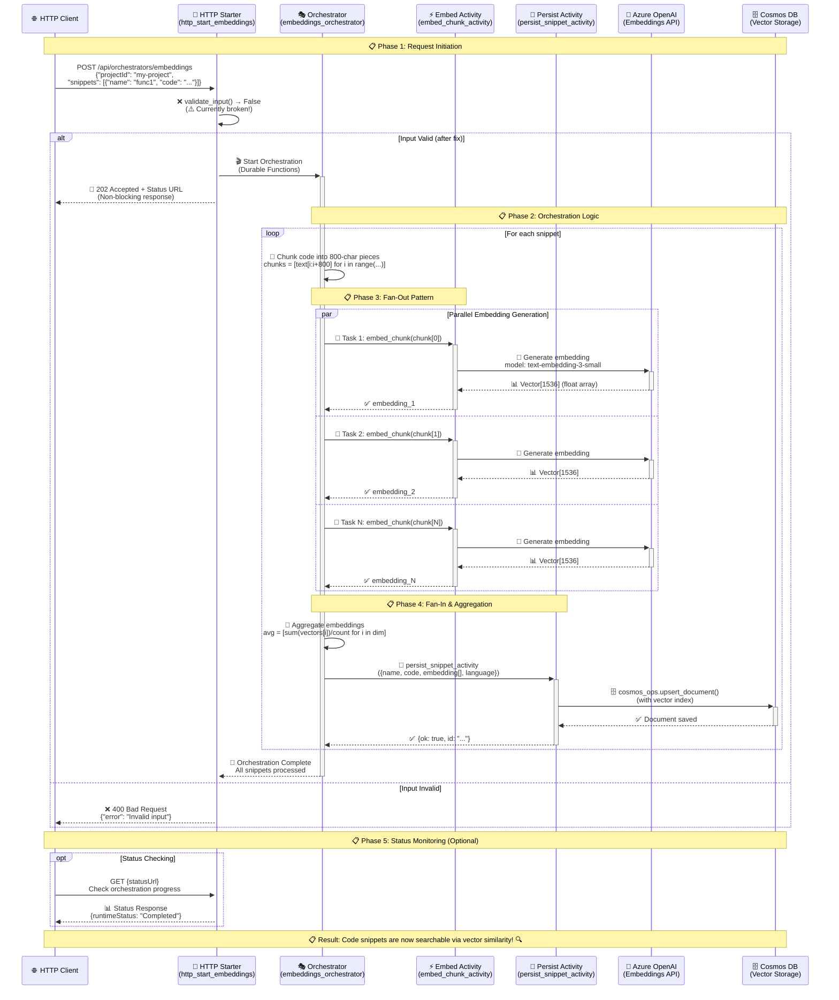

# 🏊‍♂️ Embeddings Orchestration Swimlane Diagram

## Azure Functions Durable Orchestration - Code Snippet Embedding Pipeline



## 🏗️ **Component Responsibilities**

| Swimlane | Component | Responsibility | Technology |
|----------|-----------|----------------|------------|
| 🌐 | **HTTP Client** | Initiates requests, monitors status | REST API calls |
| 🚀 | **HTTP Starter** | Validates input, starts orchestration | Azure Functions HTTP trigger |
| 🎭 | **Orchestrator** | Coordinates workflow, manages fan-out/fan-in | Durable Functions (sync) |
| ⚡ | **Embed Activity** | Generates embeddings for text chunks | Azure Functions Activity (async) |
| 💾 | **Persist Activity** | Saves processed data to database | Azure Functions Activity (async) |
| 🧠 | **Azure OpenAI** | Converts text to vector embeddings | AI/ML Service |
| 🗄️ | **Cosmos DB** | Stores snippets with vector search capability | NoSQL Database |

## 🔄 **Data Flow Transformation**

```mermaid
graph LR
    A[📝 Raw Code Snippet] --> B[🔪 Text Chunks<br/>800 chars each]
    B --> C[🧠 Individual Embeddings<br/>Vector[1536] each]
    C --> D[🧮 Aggregated Embedding<br/>Mean Vector[1536]]
    D --> E[💾 Stored Document<br/>Code + Vector + Metadata]
    E --> F[🔍 Searchable via<br/>Vector Similarity]
```

## ⚡ **Key Benefits of This Architecture**

1. **🔄 Scalability**: Parallel processing of multiple chunks
2. **🛡️ Reliability**: Durable Functions handle failures gracefully
3. **📊 Monitoring**: Built-in status tracking and replay safety
4. **🚀 Performance**: Non-blocking responses with async operations
5. **🔍 Searchability**: Vector embeddings enable semantic search

## ⚠️ **Current Issue to Fix**

```python
def validate_input(input: dict) -> bool:
    """Validate the input JSON for the orchestration."""
    return False  # ❌ This breaks all requests!
```

**Should be:**
```python
def validate_input(input: dict) -> bool:
    """Validate the input JSON for the orchestration."""
    if not input or not isinstance(input, dict):
        return False
    
    snippets = input.get("snippets", [])
    if not isinstance(snippets, list) or not snippets:
        return False
        
    # Validate each snippet has required fields
    for snippet in snippets:
        if not isinstance(snippet, dict):
            return False
        if not snippet.get("name") or not snippet.get("code"):
            return False
            
    return True  # ✅ Valid input
```
